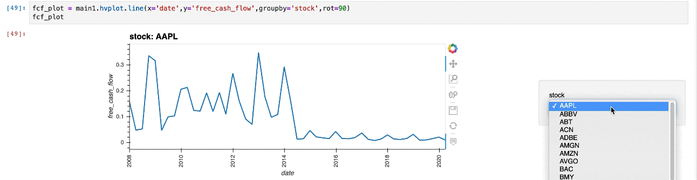

# Financial Factor Analysis

## Overview
This project analyzes three financial factors using Financial Modeling Prep API, and getting daily returns from Alpaca API.
## Factors
* Free Cash Flow
* Earnings Yield
* Book Value per Share

For this project we wanted to compare the Top 50 stocks of the S&P 500 by pulling quarterly values from 2008 to 2020.

We were able to create the follow data frame to compare factors:

## Analysis
After creating the data frame we were able to visualize the three factors.

### Free Cash Flow of Each Stock in the Top 50

### Earnings Yield of Each Stock in the Top 50

### Book Value per Share of Each Stock in the Top 50

### Quarterly Returns of Each Sector in the Top 50

### Free Cash Flow and Quarterly Returns by Sector

### Earnings Yield and Quarterly Returns by Sector

### Apple: Free Cash Flow and Qaurterly Returns

### McDonald's : Book Value per Share and Qaurterly Returns

### Scatter Plot: Book Value per Share and Quarterly Returns in Industrials Sector

In the industrials sector is looks like there is a little correlation between yearly average returns and yearly average book value per share.

### Scatter Plot: Free Cash Flow and Quarterly Returns in Energy Sector

When we look at the energy sector, there seems to be a correlation to free cash flow and returns.

### Scatter Plot: Earnings Yield and Quarterly Returns in Energy Sector

Another positive correlation is shown in the energy sector, but this time with earnings yield and returns.

# How to Use
If you are planning to use this code be sure to have an API key for Financial Modeling Prep and Alpaca. 

You will be able to chose which tickers you would like, but do keep in mind that if you are using the free version of Financial Modeling Prep you are limited to 250 pulls per API key.

If you are changing tickers make sure to change cells with:
* top_50_stocks list
* sectors
* ticker list for Alpaca API

After you run the code you should have a data frame with date, stock ticker, free cash flow, earnings yield, book value per share, and quarterly returns.

Depending on how you want to plot values you may want to multiple values by 100. 

The code includes plots that show:
* individual free cash flow, earnings yield, book value per share, plots for each stock,
* cumulative returns for each sector,
* bar graphs that compare free cash flow and earnings yield to returns by sector, and
* scatter plots comparing each factor to returns
